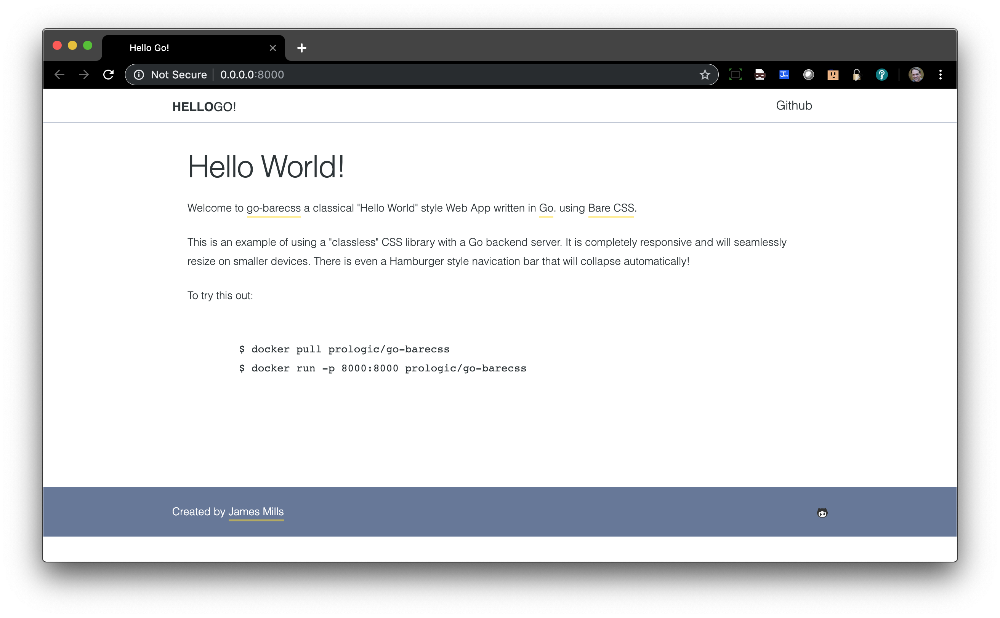
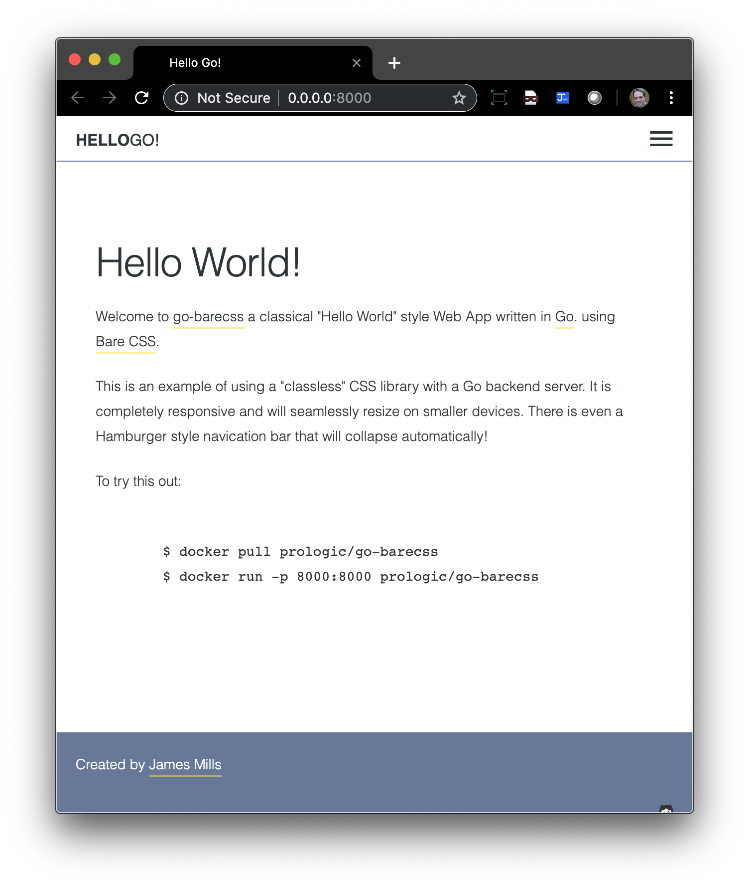

# go-barecss

[](https://cloud.drone.io/prologic/go-barecss)
[](https://codecov.io/gh/prologic/go-barecss)
[](https://goreportcard.com/report/prologic/go-barecss)
[](https://godoc.org/github.com/prologic/go-barecss) 
[](https://sourcegraph.com/github.com/prologic/go-barecss?badge)

go-barecss is a classical "Hello World!" style Web App written in
[Go](https://golang.org) (*Golang*) and using the following frontend libraries:

- [BareCSS](http://barecss.com/)




## Installation

### Source

```#!bash
$ go install github.com/prologic/go-barecss/...
```

## Usage

Run go-barecss:

```#!bash
$ go-barecss 
```

Then visit: http://localhost:8000/

## License

MIT
